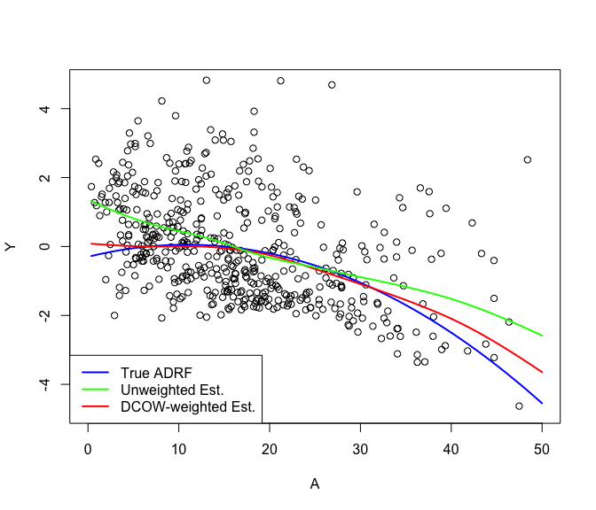

# independenceWeights

<!-- badges: start -->
<!-- badges: end -->

The `independenceWeights` package constructs weights designed to
minimize the weighted statistical dependence between a continuous
exposure variable and a vector of confounder variables and implements
the methods of Huling, Greifer, and Chen (2021) for doing so.

## Installation

<!-- You can install the released version of independenceWeights from [CRAN](https://CRAN.R-project.org) with: -->
<!-- ``` r -->
<!-- install.packages("independenceWeights") -->
<!-- ``` -->

Install the development version from [GitHub](https://github.com/) with:

``` r
# install.packages("devtools")
devtools::install_github("jaredhuling/independenceWeights")
```

## Example

This is a basic example which shows how to estimate and utilize the
distance covariance optimal weights (DCOWs) of Huling, Greifer, and Chen
(2021):

``` r
library(independenceWeights)
```

Simulate data with a continuous treatment that has a confounded
relationship with a response. Data are simulated according to the
simulation setup of Vegetabile et al. (2021).

``` r
simdat <- simulate_confounded_data(seed = 999, nobs = 500)
y <- simdat$data$Y ## response
A <- simdat$data$A ## treatment
X <- as.matrix(simdat$data[c("Z1", "Z2", "Z3", "Z4", "Z5")]) ## confounders
```

Now estimate weights to adjust for confounders using the distance
covariance optimal weights (DCOWs), which aim to mitigate the dependence
between *A* and *X*:

``` r
dcows <- independence_weights(A, X)

dcows
#> Unweighted distance covariance:           0.3963 
#> Optimized weighted dependence distance:   0.0246 
#> Effective sample size:                  264.0099 
#> 
#> Weight ranges:
#>    Min. 1st Qu.  Median    Mean 3rd Qu.    Max. 
#>  0.0000  0.2767  0.8215  1.0000  1.4120  5.7360
```

Alternatively, information about any set of weights can be printed via

``` r
weighted_energy_stats(A, X, dcows$weights)
#> Unweighted distance covariance:            0.3963 
#> Weighted dependence distance:              0.0246 
#> Weighted energy distance(A, weighted A):   0.0014 
#> Weighted energy distance(X, weighted X):   0.0025 
#> Effective sample size:                   264.0099
```

Now use the weights to estimate the causal average dose response
function (ADRF)

``` r
## create grid
trt_vec <- seq(min(simdat$data$A), 50, length.out=500)

## estimate ADRF
adrf_hat <- weighted_kernel_est(A, y, dcows$weights, trt_vec)$est

## estimate naively without weights
adrf_hat_unwtd <- weighted_kernel_est(A, y, rep(1, length(y)), trt_vec)$est

ylims <- c(-4.75, 4.75)
plot(x = simdat$data$A, y = simdat$data$Y, ylim = ylims, 
     xlim = c(0,50),
     xlab = "A", ylab = "Y")
## true ADRF
lines(x = trt_vec, y = simdat$true_adrf(trt_vec), col = "blue", lwd=2)
## estimated ADRF
lines(x = trt_vec, y = adrf_hat, col = "red", lwd=2)
## naive estimate
lines(x = trt_vec, y = adrf_hat_unwtd, col = "green", lwd=2)
legend("bottomleft", c("True ADRF", "Unweighted Est.", "DCOW-weighted Est."),
       col = c("blue", "green", "red"), lty = 1, lwd = 2)
```



## References

<div id="refs" class="references csl-bib-body hanging-indent">

<div id="ref-huling2021independence" class="csl-entry">

Huling, Jared D, Noah Greifer, and Guanhua Chen. 2021. “Independence
Weights for Causal Inference with Continuous Exposures.” *arXiv Preprint
arXiv:2107.07086*. <https://arxiv.org/abs/2107.07086>.

</div>

<div id="ref-vegetabile2021nonparametric" class="csl-entry">

Vegetabile, Brian G, Beth Ann Griffin, Donna L Coffman, Matthew Cefalu,
Michael W Robbins, and Daniel F McCaffrey. 2021. “Nonparametric
Estimation of Population Average Dose-Response Curves Using Entropy
Balancing Weights for Continuous Exposures.” *Health Services and
Outcomes Research Methodology* 21 (1): 69–110.

</div>

</div>
